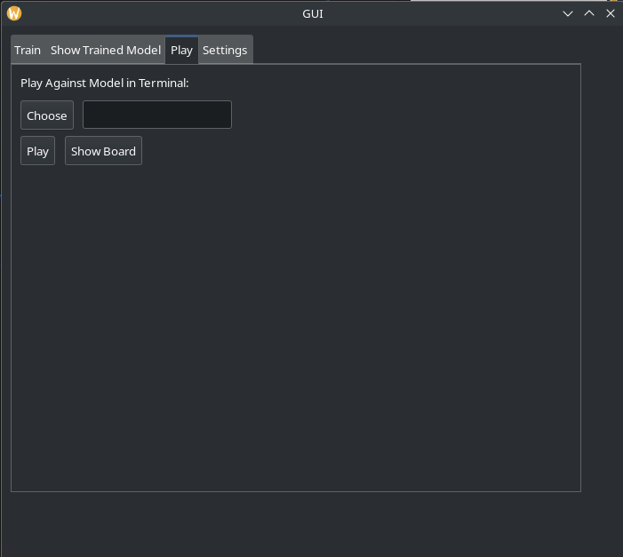

# Application Guide

## Instructions

When you open the app you'll be greeted to something like the image below:
<p align="center">
  
  <br>Figure 1: App on First Glance
</p>
The app has 4 tabs that are called "Training", "Show Trained Model", "Play", and "Settings".

In Figure 1 the "Train" tab is open. Its function is to be used to generate models to play against later. In the textbox the user has to input the number of games the model is trained for. Typically a good number is about 600. Below it are some checkboxes. The top ones are for choosing the faction the trained model will have and the bottom ones are for choosing the faction the model will be trained against. The bottom two buttons are for deleting all of the model files saved in the /40kAI/models/ directory and to start the training process, respectfully. 

<p align="center">
    
    <br>Figure 2: A representation of the "Show Trained Model" tab
</p>

In the second tab called "Show Trained Model" (shown in Figure 2) displays a visualization of games played in the training phase. The purpose of this is to show the progression of the model as training progresses. 

<p align="center">
    
    <br>Figure 3: "Play" section in the app
</p>

Figure 3 shows the "Play" tab of the app. The user selects a model file with the "Choose" button and then plays a game against said model with the "Play" button. It will be played in the terminal and the board will be visible from board.txt.

<p align="center">
    
    <br>Figure 4: Settings page
</p>

The "Settings" page shown above does not show much at the moment, but currently it allows the user to change the orientation of the tabs. 

## Compile

```bash
$ cd gui/build
$ cmake ..
$ cmake --build . --config Debug
```